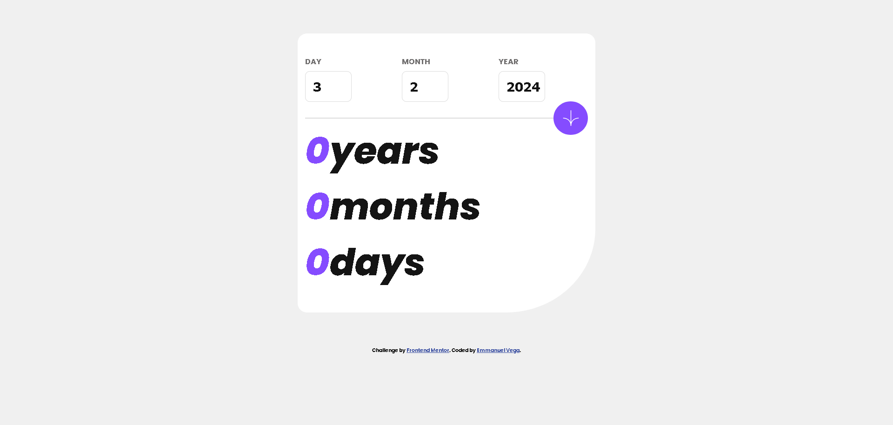

# Frontend Mentor - Age calculator app solution

This is a solution to the [Age calculator app challenge on Frontend Mentor](https://www.frontendmentor.io/challenges/age-calculator-app-dF9DFFpj-Q). Frontend Mentor challenges help you improve your coding skills by building realistic projects.

## Table of contents

- [Overview](#overview)
  - [The challenge](#the-challenge)
  - [Screenshot](#screenshot)
  - [Links](#links)
- [My process](#my-process)
  - [Built with](#built-with)
  - [What I learned](#what-i-learned)
  - [Continued development](#continued-development)
  - [Useful resources](#useful-resources)
- [Author](#author)
- [Acknowledgments](#acknowledgments)

## Overview

### The challenge

Users should be able to:

- View an age in years, months, and days after submitting a valid date through the form
- Receive validation errors if:
  - Any field is empty when the form is submitted
  - The day number is not between 1-31
  - The month number is not between 1-12
  - The year is in the future
  - The date is invalid e.g. 31/04/1991 (there are 30 days in April)
- View the optimal layout for the interface depending on their device's screen size
- See hover and focus states for all interactive elements on the page
- **Bonus**: See the age numbers animate to their final number when the form is submitted

### Screenshot

### Links

- Solution URL: [https://github.com/vcgmuse/Frontend-Mentor/tree/main/age-calculator-app-main]
- Live Site URL: [https://vcgmuse.github.io/Frontend-Mentor/age-calculator-app-main/]

## My process
I started with all of the UI and UX Elements. I made sure tha the overall struture fit the design that was expected. Then I worked on the error states and invalid states. I find that working on these states before working on logic really limits what could go wrong. Then I worked on the basic detection of inputs and interfaces, like buttons and onblur or focus. 
### Built with

- Semantic HTML5 markup
- CSS custom properties
- Flexbox
- Mobile-first workflow

### What I learned
I learned from this project the importance of thinking through the UI and UX elements when fleshing out the design. The error states and invalid states really can be difficult to handle if you do not have something that visually represents each state. The console is very helpful to debug a situation, but it is at times faster to have a visual que. The other important concept I learned from this was the thinking through of Edge Cases. I know that the basic design didn't call for specific checking of days and months, but I took it as a challenge to make the app functional.

### Continued development

There are a few edge cases that I'm sure I didn't think about and I would like to go back and find the. Something in the future that would be great is a way to track data of important birthdays a user might have and possible cross reference them with celebrities or events. 

## Author

- Website - [https://github.com/vcgmuse]
- Frontend Mentor - [@vcgmuse](https://www.frontendmentor.io/profile/vcgmuse)

