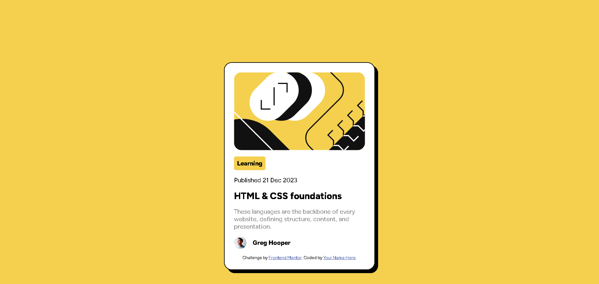

# Frontend Mentor - Blog preview card solution

This is a solution to the [Blog preview card challenge on Frontend Mentor](https://www.frontendmentor.io/challenges/blog-preview-card-ckPaj01IcS). Frontend Mentor challenges help you improve your coding skills by building realistic projects. 

## Table of contents

- [Overview](#overview)
  - [The challenge](#the-challenge)
  - [Screenshot](#screenshot)
  - [Links](#links)
- [My process](#my-process)
  - [Built with](#built-with)
  - [What I learned](#what-i-learned)
  - [Continued development](#continued-development)
  - [Useful resources](#useful-resources)
- [Author](#author)
- [Acknowledgments](#acknowledgments)

**Note: Delete this note and update the table of contents based on what sections you keep.**

## Overview

### The challenge

Users should be able to:

- See hover and focus states for all interactive elements on the page

### Screenshot

### Links

- Solution URL: [https://github.com/vcgmuse/Frontend-Mentor/tree/main/blog-preview-card-main]
- Live Site URL: [https://vcgmuse.github.io/Frontend-Mentor/blog-preview-card-main/]

## My process

### Built with

- Semantic HTML5 markup
- CSS custom properties
- Flexbox
- Mobile-first workflow
- Pure HTML, CSS

### What I learned

I learned how to work with images at different @media resolutions and how margin and padding affect them.

### Continued development

I would like to know if there are better practices to get the same results or better. Something that bothers me is the transition between screens when using responsive in the inspect mode.

## Author

- Website - [Emmanuel Vega](https://vcgmuse.github.io/Frontend-Mentor/blog-preview-card-main/)
- Frontend Mentor - [@vcgmuse](https://www.frontendmentor.io/profile/vcgmuse)
- Github - [@vcgmuse](https://github.com/vcgmuse)

## Acknowledgments
