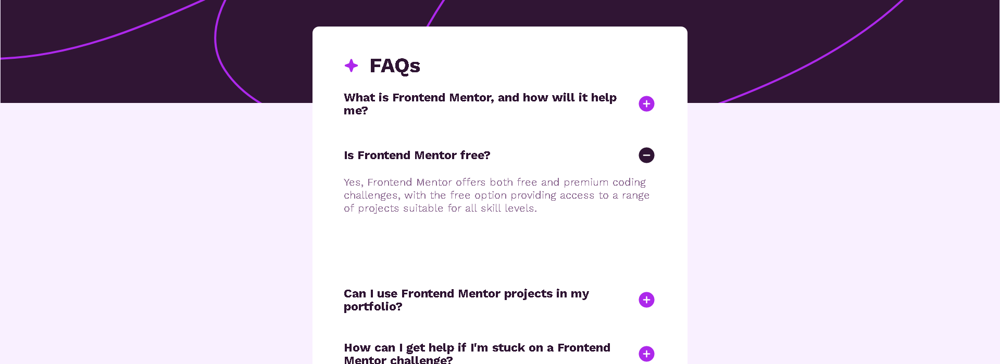

# Frontend Mentor - FAQ accordion solution

This is a solution to the [FAQ accordion challenge on Frontend Mentor](https://www.frontendmentor.io/challenges/faq-accordion-wyfFdeBwBz). Frontend Mentor challenges help you improve your coding skills by building realistic projects. 

## Table of contents

- [Overview](#overview)
  - [The challenge](#the-challenge)
  - [Screenshot](#screenshot)
  - [Links](#links)
- [My process](#my-process)
  - [Built with](#built-with)
  - [What I learned](#what-i-learned)
  - [Continued development](#continued-development)
  - [Useful resources](#useful-resources)
- [Author](#author)
- [Acknowledgments](#acknowledgments)

**Note: Delete this note and update the table of contents based on what sections you keep.**

## Overview

### The challenge

Users should be able to:

- Hide/Show the answer to a question when the question is clicked
- Navigate the questions and hide/show answers using keyboard navigation alone
- View the optimal layout for the interface depending on their device's screen size
- See hover and focus states for all interactive elements on the page

### Screenshot

### Links

- Solution URL: [Add solution URL here](https://your-solution-url.com)
- Live Site URL: [Add live site URL here](https://your-live-site-url.com)

## My process

I started with laying out the various sections This site was going to use. Then I shaped the divs and segments based on how they were going to be laidout. First the layout was based on a mobile design first followed by the desktop version. I focused on the display flex layout then proceeded with the margin and padding. The next step was to get the styles down with background images followed by fonts and other aesthetics. After working with the style guide and positioning of the the various elements, I worked on the functionality of the page and hide the p tags. I started with the main interaction of the img and if it was clicked. This lead me to show the effects of the img change and paragraph being displayed with display: 'block'. Then I worked on how the changes will affect each other after they have been clicked. If one things hides when another is clicked. After getting most of the functionality down, I worked making the code easier to read. 

### Built with

- Semantic HTML5 markup
- CSS custom properties
- Flexbox
- Mobile-first workflow

### What I learned

The main thing that I learned was using css and JS to create dynamic enviroments for users to interact with. In particular the .selected in the css in combination with the JS code used.

### Continued development

I would like to figure out how to handle the spacebar event and making the rest of the elements hide when pressing. I was able to figure out how to do this with the click events, but was a bit harder to figure out with the key. 

## Author

- Website - [Emmanuel Vega](https://vcgmuse.github.io/Frontend-Mentor/faq-accordion-main/)
- Frontend Mentor - [@vcgmuse](https://www.frontendmentor.io/profile/vcgmuse)
- Linkedin - [@vcgmuse](https://www.linkedin.com/in/vcgmuse/)
- Github - [@vcgmuse](https://github.com/vcgmuse)

## Acknowledgments

Thanks to coding dojo for helping me out get this far, I look forwards to the next stacks that we will be learning.
