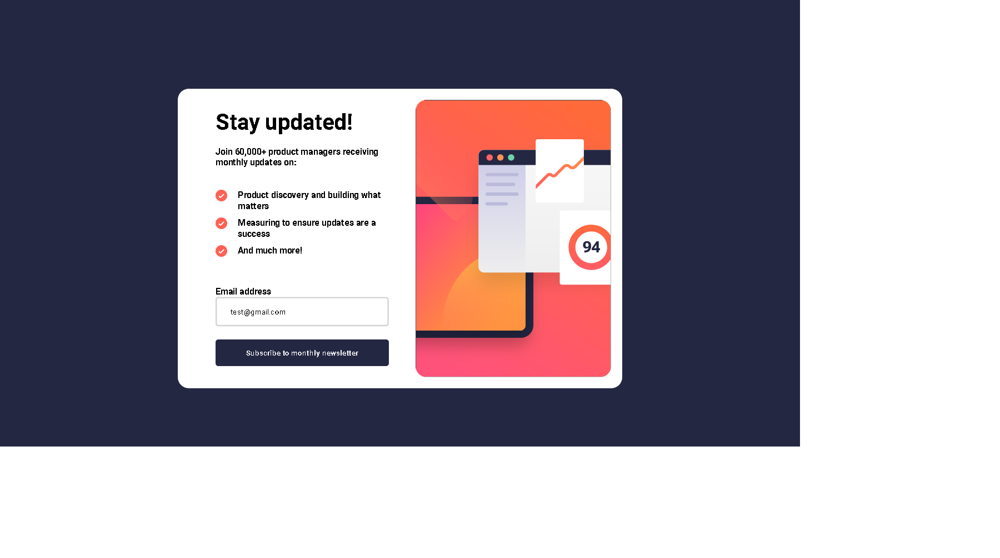

# Frontend Mentor - Newsletter sign-up form with success message solution

This is a solution to the [Newsletter sign-up form with success message challenge on Frontend Mentor](https://www.frontendmentor.io/challenges/newsletter-signup-form-with-success-message-3FC1AZbNrv). Frontend Mentor challenges help you improve your coding skills by building realistic projects. 

## Table of contents

- [Overview](#overview)
  - [The challenge](#the-challenge)
  - [Screenshot](#screenshot)
  - [Links](#links)
- [My process](#my-process)
  - [Built with](#built-with)
  - [What I learned](#what-i-learned)
  - [Continued development](#continued-development)
  - [Useful resources](#useful-resources)
- [Author](#author)
- [Acknowledgments](#acknowledgments)

**Note: Delete this note and update the table of contents based on what sections you keep.**

## Overview

### The challenge

Users should be able to:

- Add their email and submit the form
- See a success message with their email after successfully submitting the form
- See form validation messages if:
  - The field is left empty
  - The email address is not formatted correctly
- View the optimal layout for the interface depending on their device's screen size
- See hover and focus states for all interactive elements on the page

### Screenshot



### Links

- Solution URL: [Add solution URL here](https://github.com/vcgmuse/Frontend-Mentor/tree/main/newsletter-sign-up-with-success-message-main)
- Live Site URL: [Add live site URL here](https://vcgmuse.github.io/Frontend-Mentor/newsletter-sign-up-with-success-message-main/)

## My process

### Built with

- Semantic HTML5 markup
- CSS custom properties
- Flexbox
- Mobile-first workflow

### What I learned

I learned that browsers, can interpret css differently even though I provided some css resets. There were issues that came in from I don't know where and I had to create a solution. The solution was to user navigation.userAgent to determine the browser version and inject CSS specific to the broswer to handle the correct margins. 

To see how you can add code snippets, see below:


```js
let userAgent = navigator.userAgent;
if (userAgent.indexOf("Firefox") !== -1) {
  // Inject a style block with a media query for Firefox
  let cssRules = '@media screen and (min-width: 1440px) { main { margin: 10rem 35rem; } }' ;
  let style = document.createElement('style');
  style.textContent = cssRules;
  document.head.appendChild(style);
}
```

### Continued development

With time and better understanding of the backend I wouldl ike to flesh out the capabilities of the website by adding server support and email services. 

### Useful resources

## Author

- Website - [Add your name here](https://www.your-site.com)
- Frontend Mentor - [@vcgmuse](https://www.frontendmentor.io/profile/vcgmuse)
- Github - [@vcgmuse](https://github.com/vcgmuse)
