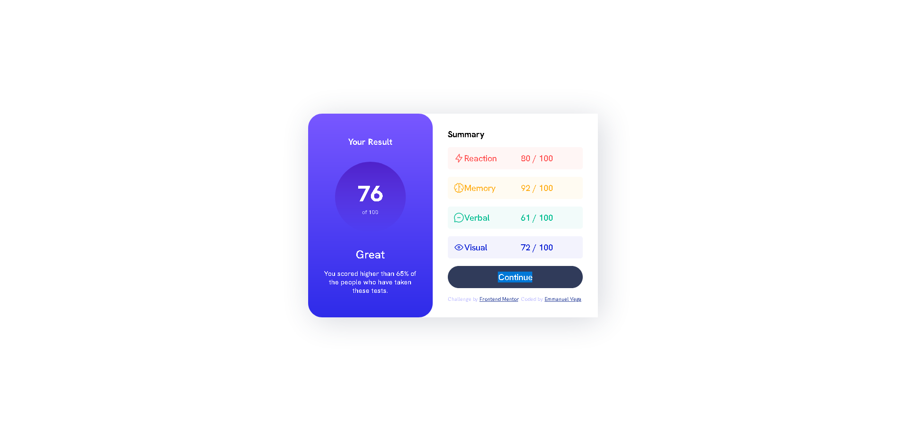

# Frontend Mentor - Results summary component solution

This is a solution to the [Results summary component challenge on Frontend Mentor](https://www.frontendmentor.io/challenges/results-summary-component-CE_K6s0maV). Frontend Mentor challenges help you improve your coding skills by building realistic projects. 

## Table of contents

- [Overview](#overview)
  - [The challenge](#the-challenge)
  - [Screenshot](#screenshot)
  - [Links](#links)
- [My process](#my-process)
  - [Built with](#built-with)
  - [What I learned](#what-i-learned)
  - [Continued development](#continued-development)
  - [Useful resources](#useful-resources)
- [Author](#author)
- [Acknowledgments](#acknowledgments)

## Overview

### The challenge

Users should be able to:

- View the optimal layout for the interface depending on their device's screen size
- See hover and focus states for all interactive elements on the page
- **Bonus**: Use the local JSON data to dynamically populate the content

### Screenshot

### Links

- Solution URL: [Add solution URL here](https://your-solution-url.com)
- Live Site URL: [https://vcgmuse.github.io/Frontend-Mentor/results-summary-component-main/]

## My process
First started with the general layout and outer shell to innor core approach. I used the concept of building with legos as a perspective to how to handle the layout. I then looked to find any special case situations that need specific attention to detail, moments were special layout need attention or considerations then wrapped those with the needed divs or elements. Then I focused on the general styling color, height, width of components for the mobile version first. Simple put, making sure things were logicaly grouped and their directions set accordingly. I finished up with fine tuning of layout and fontsize and other fine details. Once that was done I used the built in fetch to generate the code for the results based on the JSON file that was provided. 

### Built with

- Semantic HTML5 markup
- CSS custom properties
- Flexbox
- Mobile-first workflow
- [Styled Components](https://styled-components.com/) - For styles

### Continued development

I think that the input section needs to be created and I would like to flesh that out. 

## Author

- Github - [https://github.com/vcgmuse]
- Frontend Mentor - [@vcgmuse](https://www.frontendmentor.io/profile/vcgmuse)
